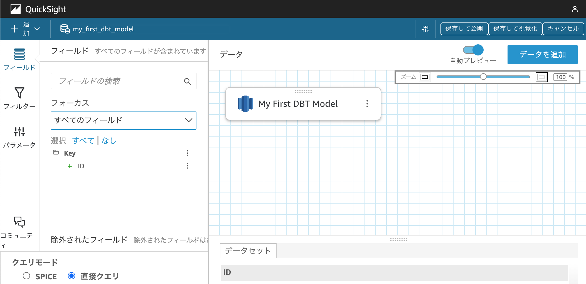

# dbt_quicksight_lineage

[](https://pypi.org/project/dbt-quicksight-lineage)
[](https://pypi.org/project/dbt-quicksight-lineage)

-----
PyPI: https://pypi.org/project/dbt-quicksight-lineage/
Target DBT Version: 1.5.*

**Table of Contents**

- [Installation](#installation)
- [License](#license)

## Installation

```console
pip install dbt-quicksight-lineage
```

## Usage

```console
Usage: dbt-quicksight-lineage [OPTIONS] COMMAND [ARGS]...

  dbt-quicksight-lineage: DBT to QuickSight Lineage command helper

Options:
  --version                       Show the version and exit.
  --log-level [DEBUG|INFO|WARNING|ERROR|CRITICAL]
                                  Set log level
  --no-color / --color            Disable color in output
  -h, --help                      Show this message and exit.

Commands:
  init             Modify schema.yml to add QuickSight metadata with Data...
  update-data-set  Update QuickSight DataSet from DBT Manifest
```

### QuickStart

```console
dbt-quicksight-lineage init --project-dir /path/to/dbt/project --data-set-id <data-set-id>
```

modify your `schema.yml` to add QuickSight metadata with Data Lineage

for example:
```yaml
version: 2

models:
  - name: my_first_dbt_model
    description: "A starter dbt model"
    meta:
      quicksight:
        logical_table_name: My First DBT Model
        data_sets:
          - id: 00000000-0000-0000-0000-000000000000
            data_source_arn: arn:aws:quicksight:ap-northeast-1:123456789012:datasource/00000000-0000-0000-0000-000000000000
    columns:
      - name: id
        description: "The primary key for this table"
        meta:
          quicksight:
            field_name: ID
            folder: Key
        tests:
          - unique
          - not_null

  - name: my_second_dbt_model
    description: "A starter dbt model"
    columns:
      - name: id
        description: "The primary key for this table"
        tests:
          - unique
          - not_null
```

and update data set
```console
dbt-quicksight-lineage update-data-set --project-dir /path/to/dbt/project --data-set-id <data-set-id>
```



## License

`dbt-quicksight-lineage` is distributed under the terms of the [MIT](https://spdx.org/licenses/MIT.html) license.
